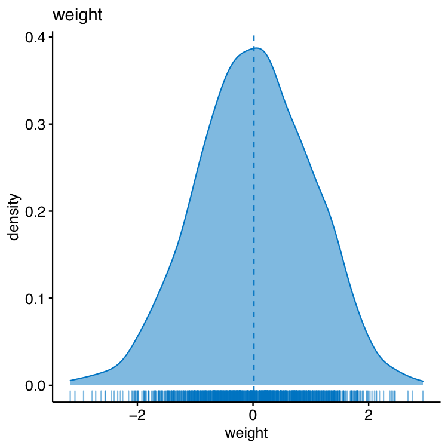
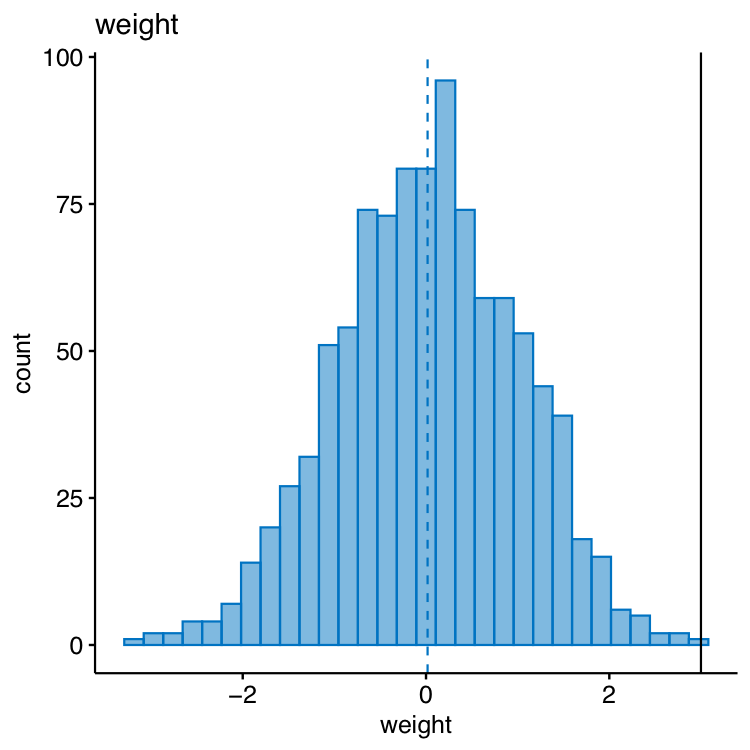
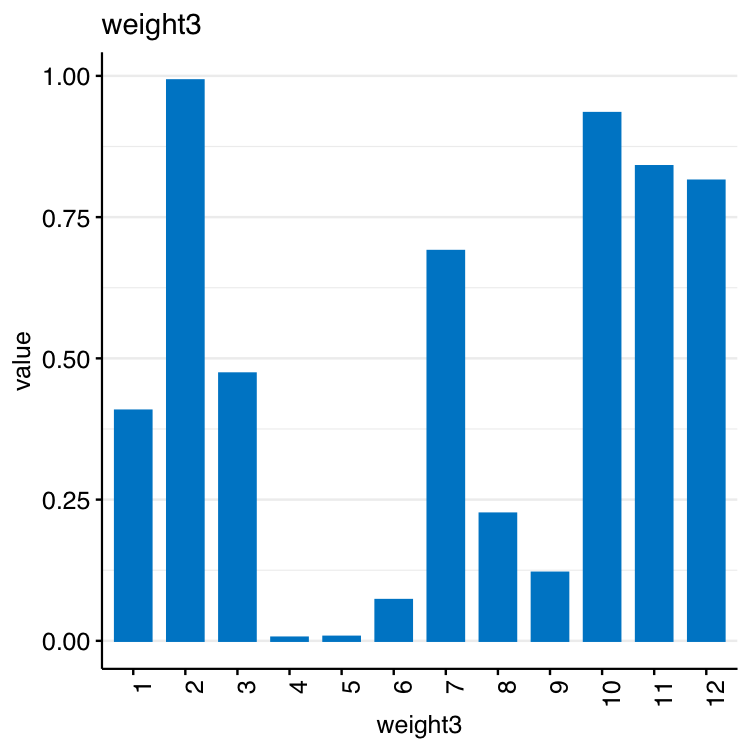
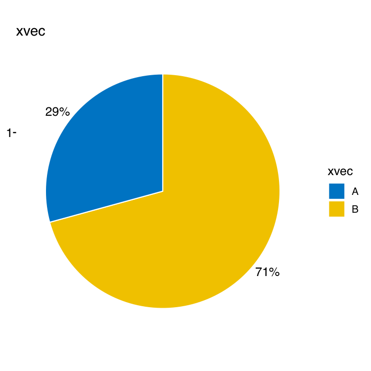
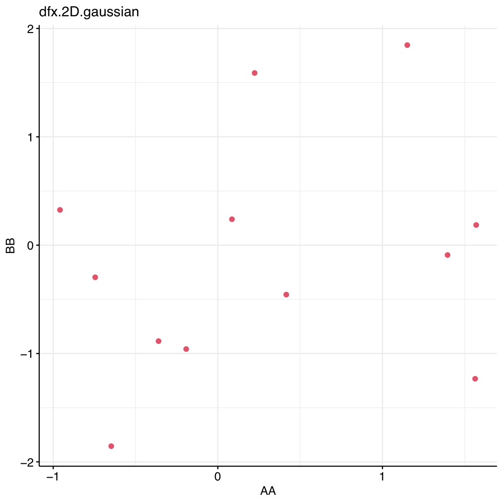

# ggExpressDev
Development of ggExpress package for quick ggpubr based plotting


## List of functions

- #### `qhistogram()`

- #### `qdensity()`

- #### `qbarplot()`

- #### `qpie()`

- #### `qscatter()`


<br><br>

## Installation

Install directly from **GitHub** via **devtools** with one R command:

```R
# install.packages("devtools"); # If you don't have it.
require("devtools")
devtools::install_github(repo = "vertesy/ggExpressDev")
```

...then simply load the package:

```R
require("ggExpressDev")
```

Alternatively, you simply source it from the web. 
*This way function help will not work, and you will have no local copy of the code on your hard drive.*

```r
source("https://raw.githubusercontent.com/vertesy/ggExpressDev/main/R/ggExpress.functions.R")
source("https://raw.githubusercontent.com/vertesy/ggExpressDev/main/R/ggExpress.auxiliary.functions.R")
```


### Troubleshooting

*If you encounter a **bug**, something doesn't work or unclear, please let me know by raising an issue on [ggExpressDev](https://github.com/vertesy/ggExpressDev/issues) – Please check if it has been asked.*

## Usage


```r
require(ggpubr)
require(cowplot)
require(MarkdownReports) # https://github.com/vertesy/MarkdownReportsDev

source("https://raw.githubusercontent.com/vertesy/ggExpressDev/main/ggExpress.functions.R")


weight <- rnorm(1000); 
qhistogram(weight, vline = 3)
qdensity(weight)

weight3 <- runif (12)
qbarplot(weight3)

xvec <- c("A"=12, "B"=29)
qpie(vec = xvec)


dfx <- as.data.frame(cbind("AA"=rnorm(12), "BB"=rnorm(12)))
qscatter(dfx, suffix = "2D.gaussian")

```

## Output
*Saved as pdf by default.* 







